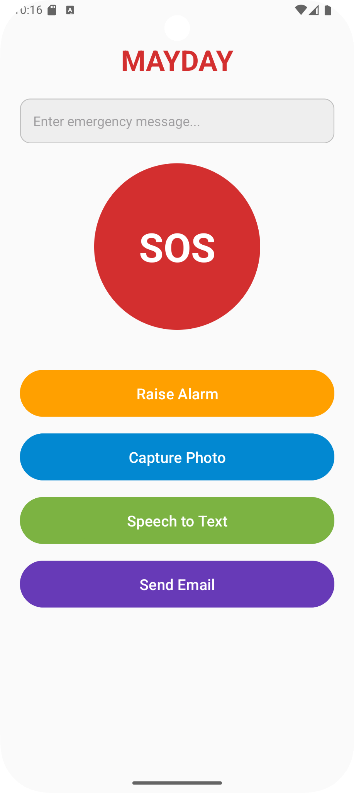

#Mobile Application Development Lab Experiments  
**Repository:** `220701251-CS19611-MADL-Experiments`  
---

## 🛠️ Experiments Included

| Experiment No. | Title | Link |
|:---|:---|:---|
| Ex. 01 | GUI Components | [View Folder](https://github.com/sierrahotel777/220701251-CS19611-MADL-Experiments/tree/main/Ex.%2001-GUI-Components) |
| Ex. 02 | Simple Calculator | [View Folder](https://github.com/sierrahotel777/220701251-CS19611-MADL-Experiments/tree/main/Ex.%202-Simple-calculator) |
| Ex. 03 | Graphical Primitives | [View Folder](https://github.com/sierrahotel777/220701251-CS19611-MADL-Experiments/tree/main/Ex.%203-Graphical-Primitives) |
| Ex. 04 | Android Fragments | [View Folder](https://github.com/sierrahotel777/220701251-CS19611-MADL-Experiments/tree/main/Ex.%2004-Android-Fragments) |
| Ex. 06 | Validation | [View Folder](https://github.com/sierrahotel777/220701251-CS19611-MADL-Experiments/tree/main/Ex.%2006-Validation) |
| Ex. 07 | SD Card | [View Folder](https://github.com/sierrahotel777/220701251-CS19611-MADL-Experiments/tree/main/Ex.%2007-SDCard) |
| Ex. 08 | Alert Dialog Box | [View Folder](https://github.com/sierrahotel777/220701251-CS19611-MADL-Experiments/tree/main/Ex.%2008-Alert-Device-Box) |
| Ex. 10 | Network Operators | [View Folder](https://github.com/sierrahotel777/220701251-CS19611-MADL-Experiments/tree/main/Ex.%2010-Network-Operators) |
| Ex. 11 | Send SMS | [View Folder](https://github.com/sierrahotel777/220701251-CS19611-MADL-Experiments/tree/main/Ex.%2011-SendSMS) |
| Ex. 12 | Send Email | [View Folder](https://github.com/sierrahotel777/220701251-CS19611-MADL-Experiments/tree/main/Ex.%2012-Send-Email) |
| Ex. 13 | Text-To-Speech | [View Folder](https://github.com/sierrahotel777/220701251-CS19611-MADL-Experiments/tree/main/Ex.%2013%20-%20Text-To-Speech) |
| Ex. 14 | Speech-To-Text | [View Folder](https://github.com/sierrahotel777/220701251-CS19611-MADL-Experiments/tree/main/Ex.%2014%20-%20Speech-To-Text) |
| Ex. 15 | Image Capture | [View Folder](https://github.com/sierrahotel777/220701251-CS19611-MADL-Experiments/tree/main/Ex.%2015-Image-Capture) |

---

## 🚀 Final Project: MAYDAY - An Emergency SOS App

**MAYDAY** is a mini-project that combines multiple features developed across the experiments:
- Emergency SMS sending
- Location sharing
- Siren activation
- Simple and intuitive UI with fragments

## 📸 Gallery

---

## ✍️ Author

**sierrahotel777**  
- GitHub: [@sierrahotel777](https://github.com/sierrahotel777)

---

## 📜 License

This project repository is created for academic and learning purposes.

---

